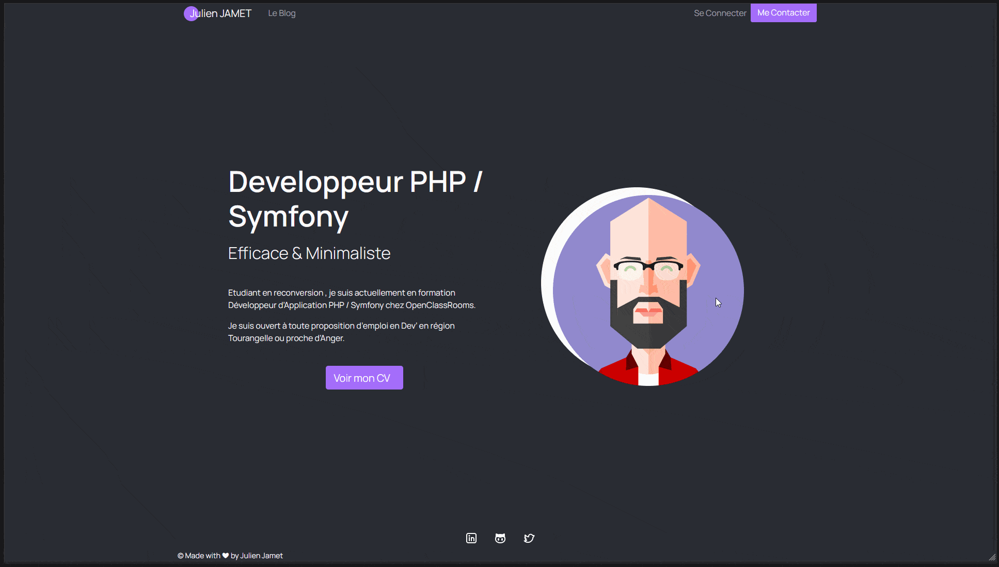
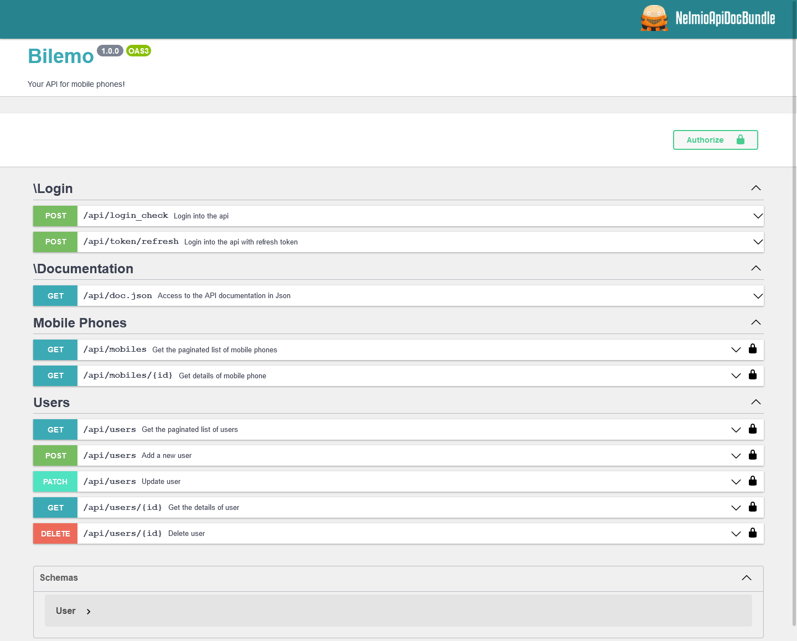

<h1 align="center">Hey 👋, I'm Julien</h1>

	<i>Autodidact, Efficient and Minimalist, it's me 🧠</i>

	
	

Having soon finished my PHP/Symfony formation via OpenClassRooms, I am ready to
take on new challenges! While waiting for an opportunity to prove my skills...

<h2 align="center">👇 Here are my training projects 👇</h2>

	

		

			
		

		
	

	

		

			
		

		
	

	

		

			
		

		
	

<h2 align="center">🧰 Languages and Tools 🛠️</h2>

	
	
	
	
	
	
	
	

